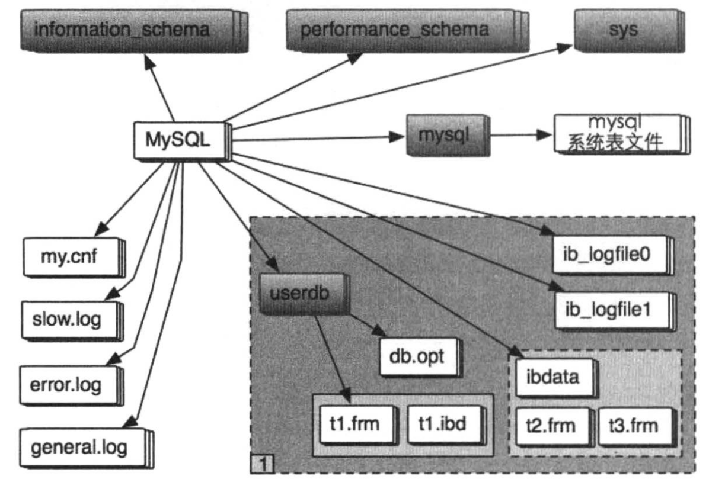

# 00_summary

* director intro
    * |directory|intro|
      |-|-|
      |btr|B+ Tree,创建/销毁/搜索/CRUD|
      |buf|buffer pool,载入/淘汰/刷盘|
      |dict|InnoDB 数据字典 加载/存储/修改/内存管理|
      |fil|物理文件读写,内存对象管理,文件扩展|
      |fsp|物理文件内部管理,数据段/物理页/簇|
      |ibuf|insert buffer,包括 insert/delete/update|
      |lock|InnoDB 行锁及表锁|
      |log|InnoDB 日志相关,包括写日志及数据恢复|
      |mem|InnoDB 内部内存管理|
      |mtr|mini transaction|
      |os|不同 os 下,与 os api 交互|
      |page|关于数据页面内数据管理的功能,包括插入/删除|
      |pars|InnoDB 内部的 sql lexer, parser|
      |que|InnoDB 内部的 状态机执行器|
      |rem|InnoDB 对物理记录的管理,包括记录比较及计算转换...|
      |row|物理记录的操作实现, crud/回滚/purge/合并...|
      |srv|InnoDB 后台管理,包含 master 线程|
      |sycn|InnoDB 读写同步功能,包含 等待队列/读写锁/mutex...|
      |trx|事务相关, MVCC/回滚段/purge/回滚记录/回滚提交...|
      |ut|内部库,经典算法, list/rb-tree/heap sort...|

0. InnoDB 文件组织
  1. 
  2. slow.log 慢查询日志,当 SQL 耗时超过 long_query_time 指定耗时,语句被记录在里面
  3. error.log 记录系统启动/运行时错误信息,通过参数 log_error 设置
  4. general.log 所有在数据库执行的SQL都会记录,影响性能
  5. datadir 目录下,每个 schema 都有目录
  6. information_schema
    * MySQL 自带,提供访问元数据(metadata)方式
  7. performance_schema
    * 主要收集数据库服务器性能参数
    * 功能
      1. 提供进程等待的详细信息, 锁/互斥量/文件信息
      2. 保存历史事件汇总信息
      3. 可添加删除监控事件点,可改变 MySQL 服务器的监控周期
  8. sys
    * 依赖 information_schema 的元数据信息库

1. [buffer system in innodb](./01_buffer.md)