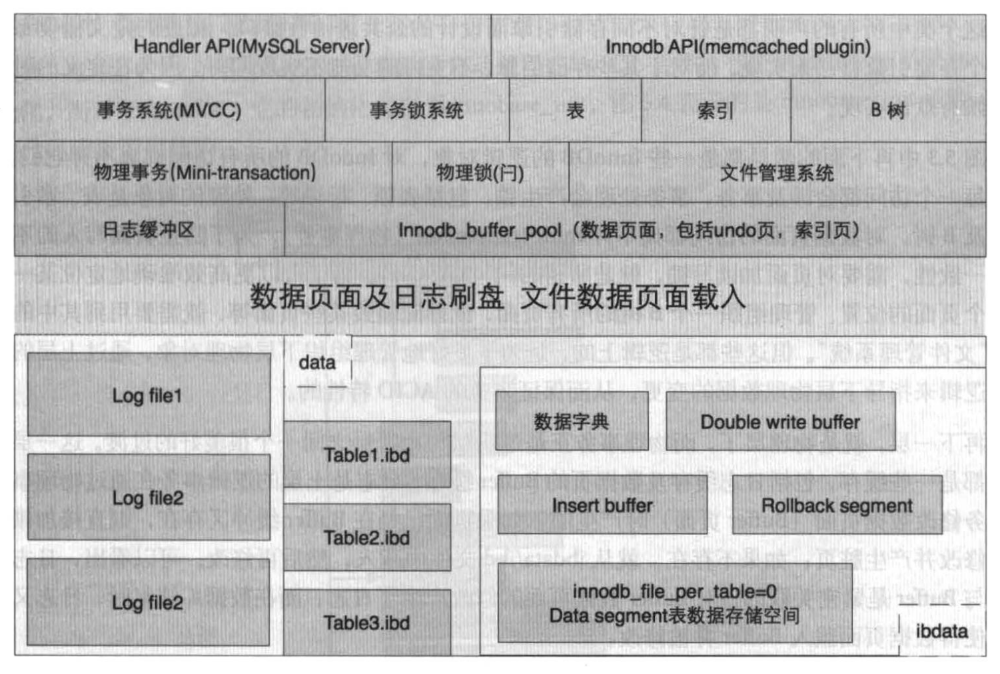
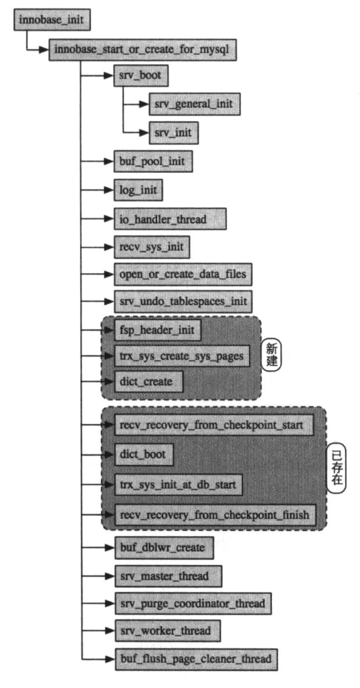

# 00_summary

* innodb source code director intro
    * |directory|intro|
      |-|-|
      |btr|B+ Tree,创建/销毁/搜索/CRUD|
      |buf|buffer pool,载入/淘汰/刷盘|
      |dict|InnoDB 数据字典 加载/存储/修改/内存管理|
      |fil|物理文件读写,内存对象管理,文件扩展|
      |fsp|物理文件内部管理,数据段/物理页/簇|
      |ibuf|insert buffer,包括 insert/delete/update|
      |lock|InnoDB 行锁及表锁|
      |log|InnoDB 日志相关,包括写日志及数据恢复|
      |mem|InnoDB 内部内存管理|
      |mtr|mini transaction|
      |os|不同 os 下,与 os api 交互|
      |page|关于数据页面内数据管理的功能,包括插入/删除|
      |pars|InnoDB 内部的 sql lexer, parser|
      |que|InnoDB 内部的 状态机执行器|
      |rem|InnoDB 对物理记录的管理,包括记录比较及计算转换...|
      |row|物理记录的操作实现, crud/回滚/purge/合并...|
      |srv|InnoDB 后台管理,包含 master 线程|
      |sycn|InnoDB 读写同步功能,包含 等待队列/读写锁/mutex...|
      |trx|事务相关, MVCC/回滚段/purge/回滚记录/回滚提交...|
      |ut|内部库,经典算法, list/rb-tree/heap sort...|

0. InnoDB 文件组织
    1. 
    2. slow.log 慢查询日志,当 SQL 耗时超过 long_query_time 指定耗时,语句被记录在里面
    3. error.log 记录系统启动/运行时错误信息,通过参数 log_error 设置
    4. general.log 所有在数据库执行的SQL都会记录,影响性能
    5. datadir 目录下,每个 schema 都有目录
    6. information_schema
      * MySQL 自带,提供访问元数据(metadata)方式
    7. performance_schema
      * 主要收集数据库服务器性能参数
      * 功能
        1. 提供进程等待的详细信息, 锁/互斥量/文件信息
        2. 保存历史事件汇总信息
        3. 可添加删除监控事件点,可改变 MySQL 服务器的监控周期
    8. sys
      * 依赖 information_schema 的元数据信息库
    9. userdb
      * 用户创建的数据库
    10. db.opt
      * 存储 MySQL 数据库的一些配置信息,例如 编码/排序 ...

1. InnoDB 体系结构
    1. 
    2. Server 层
      * Sever layer and InnoDB connect by interface in
      * @see [handler.h](../../../sql/handler.h)
    3. InnoDB 层
      * 对于事务会产生锁(表锁/行锁),对数据页面的访问需要 mini-transaction (物理事务),通过 [锁(latch)](./06_lock_latch_and_trx.md) 保证保证页面写入的一致性.
    4. 物理层
      * 物理事务实现 逻辑层 与 物理层 之间的过渡,主要是 缓存 ,包含 日志缓存,页的 buffer 缓存.
      * 日志的上层逻辑事务通过物理事务修改数据页面(buffer)产生,如果页面已经在 buffer 缓冲区存在,则直接加锁并修改脏页;若不存在,则从 ibdata/ibd 文件中载入
    5. OS IO 层
      * 处理下层物理文件与上层缓存(日志缓存及 buffer 数据页面缓存)的交互
        1. redolog io -> 当 redolog buffer 空间小于50%/ 事务提交(@see innodb_flush_log_at_trx_commit) / checkpoint 时,会对 buffer 进行落盘.
        2. 数据页面 io -> 索引数据页面 io + 回滚段页面 io ,当上层需要使用某个页面时,从文件加载;当不再使用时/ checkpoint ,页面刷盘.

2. InnoDB Storage Engine Start and Shutdown
    1. Start
      * @see       
    2. Shutdown
      * @see ![innodb_shutdown]

3. ibdata 文件存放 InnoDB元数据( InnoDB 数据字典), insert buffer, change buffer, doublewrite buffer, undologs.

1. [buffer system in innodb](./01_buffer.md)