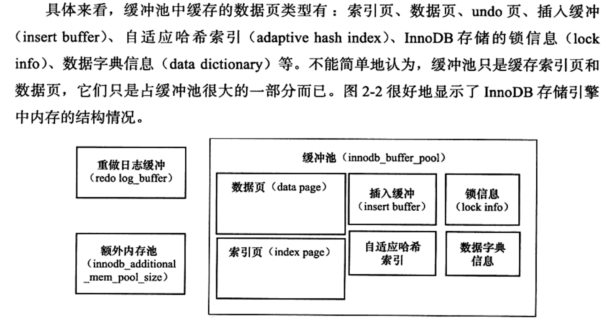
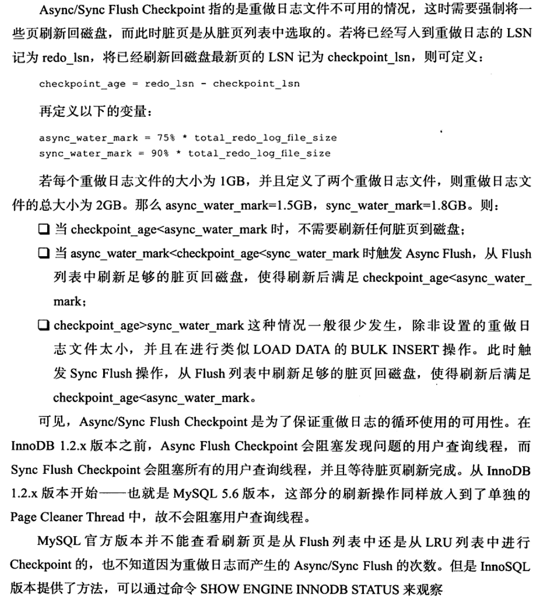

# 01_buffer

## Buffer Pool
* 

## LRU List, Free List, Flush List

1. 在 InnoDB 中写入操作不会不直接对磁盘 IO,而是引入 buffer,对 buffer IO. 
2. InnoDB 的 buffer 是一个 LRU List. InnoDB 的 LRU 不会每次直接放到 LRU 的首部,而是放到 LRU midpoint 位置,这个优化在 InnoDB 称为 **midpoint insertion strategy**.默认配置下, midpoint = 5/8.
3. 新读取的页插入到 LRU 列表尾部 37% 的位置, InnoDB 中 midpoint 之后的位置称为 old 列表, midp 之前的位置称为 new 列表.优化的意义在于,防止真正的热点数据被淘汰.
4. 为了防止热点数据被淘汰, InnoDB 引入了参数 **innodb_old_block_times** 来管理 LRU 列表,表示读取到 mid 位置后需要等待多久才会被加入到 LRU 列表的热端.
5. LRU 列表用来管理已经读取的页,需要从 buffer pool 分页
    1. 从 Free 列表查看空闲页,从 Free 列表删除放入 LRU 列表
    2. 否则从 LRU 表尾淘汰,空间分配给新页. ==> **page made yound**
    3. 因为 **innodb_old_block_times** 导致页没有从 old 到 new 的操作 ==> **page not made young**
    4. buffer pool hit rate ==> 缓冲池命中率
6. LRU 列表中的页被修改后,称为 脏页(dirty page),即 缓冲池中的页和磁盘上的页不一致.数据库会通过 CHECKPOINT 将脏页刷回磁盘. Flush 列表中的页即为脏页列表. 脏页既存在与 LRU 中,也存在于 Flush 列表中.
7. LRU 列表管理缓冲池中页的可用性,Flush 列表管理将页刷回磁盘.

## Redolog Buffer

1. InnoDB 首先将 Redolog 写入 Redolog Buffer,按照一定频率刷新到 Redolog.
2. Redolog Buffer 一般不需要设置很大,每秒会将 Redolog 刷新到日志文件,用户只需保证产生事务大小在 **innodb_log_buffer_size** 之内.
3. Redolog 刷新的时机
    1. Master Thread 每秒对 Redolog Buffer 刷盘一次
    2. 事务提交会将 Redolog Buffer 刷盘
    3. 当 Redolog Buffer 剩余空间小于 1/2, 触发 Redolog Buffer 刷盘
4. 通过 LSN(Log Sequence Number) 标记版本, LSN 8 bytes number.每个页有 LSN, Redolog 也有 LSN.
5. Checkpoint(检查点) 为了防止长时间不刷盘 Redolog Buffer 导致数据库崩溃恢复后启动慢.故障恢复后,只需对 Checkpoint 之后的 Redolog 进行恢复.
    1. Checkpoint 的策略:
        * Sharp Checkpoint - 数据库关闭时将所有的脏页刷回磁盘,默认. **innodb_fast_shutdown=1**
        * Fuzzy Checkpoint - 每次刷新部分脏页.
            * Master Thread Checkpoint -> 定时 异步
            * FLUSH_LRU_LIST Checkpoint -> InnoDB 需要保证 LRU 尾部有100个空闲页,否则移除 LRU 尾部页.尾部的脏页需要 Checkpoint . **innodb_lru_scan_depth**
            * Async/Sync Flush Checkpoint -> Redolog 不可用,需要强制刷脏.
            
            * Dirty Page too much Checkpoint -> 脏页数量太多,导致 InnoDB 强制进行 Checkpoint. **innodb_max_dirty_pages_pct**

## 额外的内存池

1. InnoDB 对内存的管理从 内存堆(Arena Memeory Allocator) 中申请,当 内存堆 空间不够,会从 buffer pool 中申请.

## 关键特性
1. Insert Buffer
    * Why? --> 非聚簇索引插入需要回表,性能差.
    * How?  
        * 先判断插入的非聚簇索引是否在 Insert Buffer,若在,则直接插入;否则,插入到 Insert Buffer.  
        * 定期对 Insert Buffer 和 非聚簇索引叶子节点 合并
    * 条件
        * 索引是辅助索引(secondary index/二级索引/非聚簇索引)  
        * 不是唯一索引(not unique index)
    * 实现
        * B+ Tree
        * 全局一颗 B+ Tree, 对所有表的二级索引进行 Insert Buffer
        * 存放在共享表空间, 默认 ibdata1

2. Change Buffer 
    * 对 DML 缓冲(Insert, Delete, Update, Purge), 有(Insert Buffer, Delete Buffer, Purge Buffer)
    * innodb_change_buffer_size default 25 max 50

3. Merge Insert Buffer
    * 将 Insert Buffer 中数据插入到辅助索引页中.
    * 触发条件
        1. 辅助索引页被读取到缓冲池 -> 多次 DML 都会放到 Insert Buffer 中, DQL 会去 Insert Buffer 中查找,触发 Merge.
        2. Insert Buffer Bitmap 页被追踪到该辅助索引页已无可用空间 -> Merge Insert Buffer 后检测到可用空间小于1/32页,强制 Merge.
        3. Master Thread -> 定时任务,根据 srv_innodb_io_capacity 百分比合并.

4. Double Write
    * 两个部分,内存中的 doublewrite buffer(2MB) 及 磁盘上表空间中连续128个页,2个区(2MB)
    * Redolog Buffer 刷脏,每1MB通过 memcpy 拷贝到内存的 doublewrite buffer,分两次,每次1MB顺序写入表空间,然后立刻fsync.
    * double write 写入页数:写入次数 ~ 64:1

5. 自适应哈希索引
    * 自动索引, hash index 更快

6. Async IO
    * 非阻塞

7. 刷新邻近页
    * 刷当前页时检测临近页的脏页,一起刷盘.
    
## 参数

1. innodb_io_capacity
    * 合并 Insert Buffer 时,合并的数量是 innodb_io_capacity 的 5%
    * 从 Redolog Buffer 刷脏页的数量是 innodb_io_capacity
2. innodb_max_dirty_page_pct
    * 过高,刷脏速度慢,数据库恢复需要更久
    * 过低,增加IO压力
3. innodb_adaptive_flushing
    * 通过 buf_flush_get_desired_flush_rate 判断刷脏的合适页数量
4. innodb_purge_batch_size
    * 控制每次 full purge 回收 Undo 页数量
5. innodb_fast_shutdown
    * 0 -> 关闭前, full purge/merge insert buffer/刷脏
    * 1 -> 默认,只做 刷脏
    * 2 -> 只会写 Redolog,这样不丢事务,下次启动时恢复