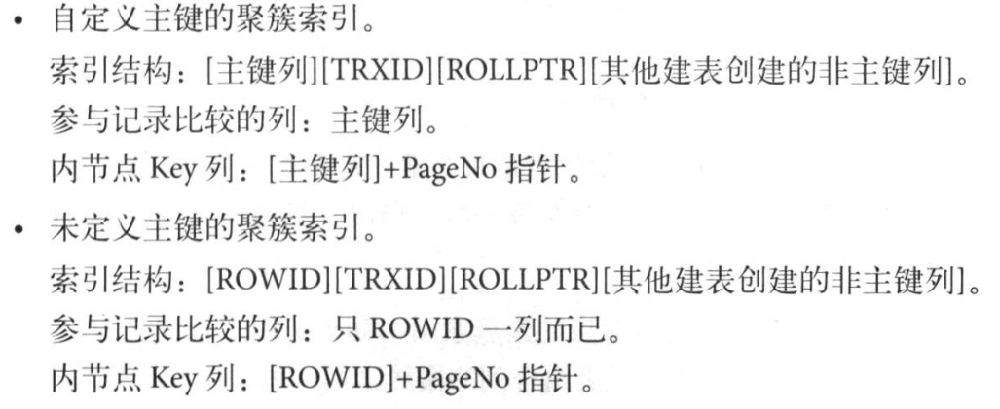
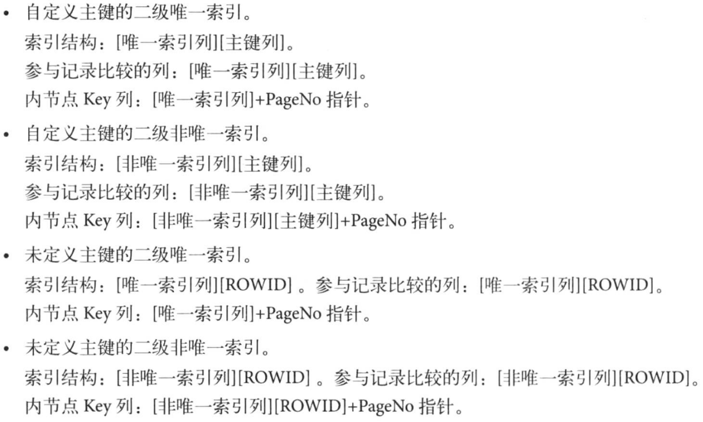

# 05_index_and_algo

* ToDo: 6.830 写DB
* ToDo: sqlite 再看看存储模块
* ToDo: Modern B-Tree Techniques

* 
* 

1. 聚簇索引
    * 聚簇索引==主键索引
    * 聚簇索引是逻辑连续的,在物理存储上可能是不连续的.通过链式结构实现.
        * 页通过双向链表连接,页按照主键的顺序排序.(在 InnoDB 中,所有的数据都在 B+ Tree 的叶子节点.)
        * 每个页的记录都通过双向链表维护,物理存储上不按照主键存储.
    * 优:按照主键查询非常快
    * 稠密索引,存储所有的数据.一个表中只有一个,建立在主键上面,主键列可以是被隐藏的 Rowid 列,也可以是 自增列/不含 null 值的组合列.
2. 非聚簇索引
    * 非聚簇索引==二级索引 -> 不是聚簇索引之外的索引
    * 叶子节点包含 键值,以及指向主键的指针
    * 稀疏索引
    * 二级索引没上限
    * 会出现 冗余索引 ,两个索引建立在相同的列上
    * 存储 键值对的值 以及 指向主键的指针
    * 在二级索引中不能找到全部数据的现象称为 非覆盖索引, 反之称为 覆盖索引.
    * 回表 -> 二级索引是 非覆盖索引 ,所以需要去 聚簇索引 中查找数据.
    * 索引过多,每次 dml 的代价会很大.
    * 统计行数可以直接使用 二级索引 ,每个二级索引和聚簇索引的总行数相同,且一对一
3. 如果表上存在很多索引,大批量 DML 操作会对所有索引进行修改.
4. Cardinality
    * 表示索引中不重复记录数量的预估值
    * 对于 Cardinality 更新触发
        * 表中 1/16 的数据已经发生变化
        * stat_modified_counter > 2 000 000 000
    * 更新策略
        1. 取得 B+ 树索引中叶子节点的数量,记为 A
        2. 随机取得 B+ 树索引中8个叶子节点,统计每个页不同记录的个数,记为 P1,P2,...,P8
        3. 根据采样信息给出预估值, Cardinality=(P1+P2+...+P8)*A/8
5. 参数

    |参数|说明|默认|
    |-|-|-|
    |innodb_stats_persistent|是否将 Cardinality 持久化到磁盘|OFF|
    |innodb_stats_on_metadata|Show Table Index,Show Index,访问Information_Schema.Tables,访问Information_Schema.Statics 是否触发重新计算|OFF|
    |innodb_stats_persistent_sample_pages|当innodb_stats_persistent=on,ANALYZE TABLE更新 Cardinality 值时每次采样的数量|20|
    |innodb_stats_traisent_sample_pages|取代innodb_stats_persistent_sample_pages|20|

6. 联合索引
    * 对多个列进行索引
    * Using filesort -> 需要额外的排序操作才能完成查询
    * 最左原则匹配,因为联合索引按照(a,b,c)的顺序进行排序

7. 覆盖索引
    * 索引中包含主键信息,不需要二次回表

8. 索引提示
    * FORCE INDEX 强制索引
    * USE INDEX 建议索引

9. Multi-Range Read 优化
    * Why? -> 减少磁盘的随机读
    * 优:
        * 对于 range, ref, eq_ref 查询:
            * MRR 使数据访问变得较为顺序.在查询辅助索引时,先根据查到的结果对主键排序,并按照主键的顺序进行书签查找.
            * 减少缓冲池中页被替换的次数.
            * 批量处理对键值的查询操作.
        * 对于 InnoDB, MyISAM 的范围查询 和 Join 查询
            * 将查询得到的辅助索引键值放在一个缓存中,缓冲中数据根据辅助索引键值排序
            * 将缓存中的键值根据 RowID 进行排序
            * 根据 RowID 的排序顺序来访问实际的数据文件
        
10. Index Condition Pushdown(ICP) 优化
    * ICP 优化支持 range, ref, eq_ref, ref_or_null 类型查询
    * How? -> 取出索引的同时,判断是否可以进行 where 条件的过滤.部分 where 条件的过滤放到存储引擎层.

11. 对于不包含主键/唯一索引的表, InnoDB 自动创建 隐藏列 GEN_CLUST_INDEX(包含 row ID 值).表中数据按照 rowID 排序.

12. B Tree & B+ Tree
    * |B Tree|B+ Tree|
        |-|-|
        |B Tree 中同一键值不会出现多次.可能出现在 叶节点 或者 非叶节点 |B+ Tree 中键一定出现在叶子节点上,也可能在非叶子节点重复出现. B+ Tree 内节点存储的都是键值,键值对应的具体数字都存储在叶节点上.|
        |B Tree 每个节点都存数据,每个节点数据量小,层数高,维护代价高,性能差|B+ Tree 内节点只存储键值|
        |B Tree 纵向扩展,性能差|B+ Tree 横向扩展,性能好|
        |B Tree 查询效率与键在 B Tree 位置相关,(叶节点)与 B+ Tree 同,(根节点)O(1)|B+ Tree 复杂度对建成的树固定|
        |B Tree 键位置不固定,整棵树出现一次, crud 复杂度高|B+ Tree 内部节点类似索引,插入只需要按层搜索,在叶节点插入.会出现叶节点存储满分裂|
        |B Tree 所有节点数据只存一份|B+ Tree 存储所有数据的叶子节点,还存储键值数据的内节点|

13. 关系型数据库索引特点
    * 数据按照行为单位存储,一样包括一个表(聚簇索引)或者一个索引(二级索引)中定义的所有列,多行数据可以连续一起存储.
    * 一行数据中,一般有一个键(主键)及其他列.对于没有主键的表, InnoDB 会定义 RowID 作为主键.
    * 在键值对中,键值可以排序,还可以组合键值.
