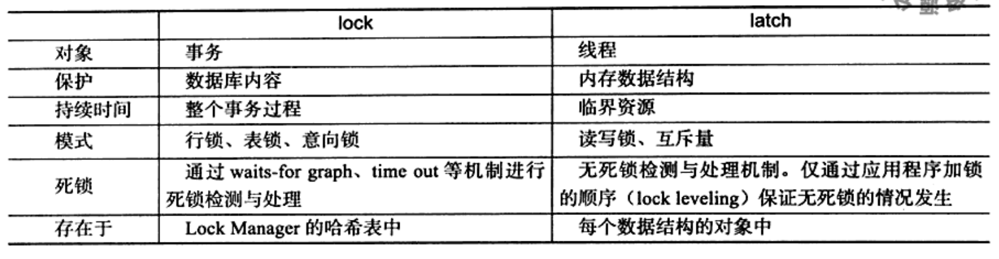
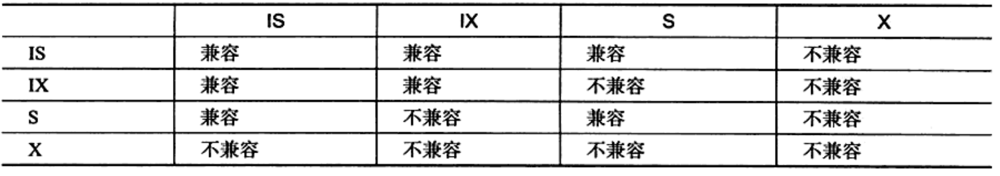

# 06_lock_and_latch

* 看下 MySQL 8.0 Reference Manual_Chp 15.7_InnoDB Locking and Transaction Model

1. lock and latch
    * latch
        * 闩锁,轻量级
        * 在 InnoDB 中有 mutex(互斥锁) rwlock(读写锁)
    * lock
        * 锁定数据库中的对象(表/页/行)
    * 

2. 事务中锁信息监控
    * SHOW FULL PROCESSLIST;
    * SHOW ENGINE INNODB STATUS;
    * Information_Schema.Innodb_trx
    * Information_Schema.Innodb_locks
    * Information_Schema.Innodb_lock_waits
    * @see [innodb_trx_fields_info](../../../storage/innobase/handler/i_s.cc)
    * @see [trx0i_s](../../../storage/innobase/trx/trx0i_s.cc)
    * @see [lock_mode 锁的模式(s,x,is,ix,...)](../../../storage/innobase/include/lock0types.h)
    * @see [lock_type 锁的类型(table,record,...)](../../../storage/innobase/include/lock0lock.h)

### InnoDB Locking

#### Shared,Exclusive and Intention Locks
1.  InnoDB 实现了两种锁机制, shared(S) locks 以及 exclusive(X) locks
    * 共享锁(S Lock),读锁
    * 排他锁(X Lock),写锁 `LOCK TABLES ... WRITE    `
    * 意向锁(IS, IX)
        * 意向共享锁(IS Lock),事务想要获得一张表中某几行的共享锁 `SELECT ... FOR SHARE`
        * 意向排他锁(IX Lock),事务想要获得一张表中某几行的排他锁 `SELECT ... FOR UPDATE`
    * 兼容性
    * 
        * Intention Locks 只会全表扫描(例如 `LOCK TABLES ... WRITE`)

#### Record Locks
1. 行锁,防止其他事务更改正在操作的数据
2. 行锁会锁定索引数据,如果表没有索引,InnoDB[自动创建主键(隐藏列,聚簇索引)](./05_index_and_algo.md)

#### Gap Locks
1. Definition:
    * a lock on a gap between index records
    * a lock on the gap before the first or after the last index record
2. InnoDB Gap Locks 是防止其他事务插入间隙.间隙锁可以共存.一个事务采用的间隙锁不会阻止另一个事务在同一间隙上采用间隙锁.共享和排他间隙锁之间没有区别.彼此不冲突,并且执行相同的功能.允许间隙锁冲突的原因是,如果从索引中清除记录,则必须合并由不同事务保留在记录上的间隙锁.
3. 事务隔离级别降低到 READ COMMITTED 可以禁用 Gap Lock.
4. InnoDB 中 where 条件判断后,不匹配的记录会释放 行锁.对于 Update 语句, InnoDB 采用 半一致性读(semi-consistent) , update 会返回最新版本,便于 InnoDB 判断行是否满足 update where conditions.
5. 触发条件: 不通过唯一索引锁定唯一行

#### Next-Key Locks
1. Netxt-Key Locks = Record Lock on the index record + Gap Lock on the gap before the index record
2. InnoDB 对于行级锁,当他搜索扫描索引时,会对遇到的索引添加 共享锁 或 排他锁.行级锁实际是索引记录锁.
3. 通过 Next-Key Locks 防止幻读. If one session has a shared or exclusive lock on record R in an index, another session cannot insert a new index record in the gap immediately before R in the index order.

#### Insert Intention Locks
1. 对于 Insert row 操作, InnoDB 会采用 Insert Intention Locks ,这种锁对于事务并发 insert 相同索引的相同位置时,两个事务之间不会互相等待.

#### AUTO-INC Locks
1. 事务中对于自增列的特殊类型锁. @see Section 15.6.1.6, "AUTO_INCREMENT Handling in InnoDB".

#### Predicate Locks for Spatial Indexes
1. 空间数据(略).

### InnoDB ACID

1. Repeatable Read
    * 对于 Locking Reads(锁定读,select for update/select for share,update,delete),锁取决于SQL使用 具有唯一搜索条件的唯一索引 还是 范围类型搜索条件 .
        * 对于 具有唯一搜索条件的唯一索引 , InnoDB 只会锁定这一行数据,对于前后的区间不会加锁
        * 对于 其他搜索条件, InnoDB 会采用 Gap Locks or Next-Key Locks.
2. Read Committed
    * Each consistent read, even within the same transaction, sets and reads its own fresh snapshot.
    * 每个一致性读的事务(包括同一个事务),都有事务自己的 snapshot (快照).
    * 对于 Locking Reads(锁定读,select for update/select for share,update,delete), InnoDB 只会锁定 index records ,不会升级为 Gap Locks.所以对于被锁数据的相邻位置可以自由 insert . Gap Locks 只会用来检查 外键约束 以及 duplicate-key 约束.
    * RC 可能幻读.
    * RC 的额外影响:
        1. UPDATE/DELETE SQL , InnoDB 持有数据的锁.不符合 where 条件数据的锁不会持有.减少死锁,不可避免.
        2. UPDATE 数据如果已经被锁定, InnoDB 会进行 semi-consistent 读,通过返回该数据的最新版本,由 InnoDB 根据 where 条件判定可见性.如果可见, InnoDB 会加锁 或者 等待获取锁.

3. RR 与 RC 区别
    * 根据文档, RR 对于 DML 会获取 Gap Locks or Next-Key Locks ,获取 x-lock on each row that it reads and does not release any of them. RC 只会获取 x-lock on each row that it reads and releases those for rows that it does not modify (只获取修改行的锁,释放其他). RC Update 采用 semi-consistent read ,判断 Update where 可见性.

4. Read Uncommitted
    * Dirty read

5. Serializable
    * autocommit=false, InnoDB 隐式对所有 select 改写为 select for share.
    * autocommit=true, Select 采用当前 session 的事务.
    * 如果事务只读,并且采用一致性读,则事务可以串行化.

6. Autocommit
    * 注意 set autocommit=false 隐式提交上个事务.

7. Consistent Nonlocking Reads(一致性非锁定读)
    * MVCC , RC 每次获取最新的快照, RR 的快照在事务开始时确定.

8. Locking Reads
    * SELECT ... FOR SHARE
    * SELECT ... FOR UPDATE
    * NOWAIT -> A locking read that uses NOWAIT never waits to acquire a row lock. The query executes immediately, failing with an error if a requested row is locked.
    * SKIP LOCKED -> A locking read that uses SKIP LOCKED never waits to acquire a row lock. The query executes immediately, removing locked rows from the result set.

9. Locks Set by Different SQL Statements in InnoDB
    1. select ... from -> 非快照隔离,锁定读,没有锁. 快照隔离,对数据 set shared next-key locks .
    2. select ... for update/share -> 使用唯一索引,符合 where 的数据加锁,其他不加锁.
    3. For a unique index with a unique search condition -> InnoDB only locks the indexs record found
    4. For other search conditions, and for non-unique indexes -> InnoDB locks the index range scanned, using gap locks or next-key locks to block insertions by other sessions into the gaps covered by the range
    5. SELECT ... FOR UPDATE 阻塞其他事务.一致性读忽略当前 read view 中记录上的锁.
    6. UPDATE ... WHERE ... 对匹配的数据加 exclusive next-key lock. 但是, 对于 a unique index with a unique search condition , InnoDB 只会添加 index record lock .
    7. 对于主键的 update,需要在相关的二级索引隐式加锁. 对于二级索引 Update , InnoDB 会加 shared locks 进行 duplicate check ,防止 insert .
    8. DELETE FROM ... WHERE ... 对数据加 exclusive next-key lock .但是,对于 using a unique index to search for a unique row 只加 index record lock .
    9. INSERT 只会对插入的记录加写锁(index record lock),而非 next-key lock (在这里,没有 gap lock). INSERT 不会防止其他 session 对相邻的位置 insert .

    ToDo:  MySQL Manual continue from Page 3033 .