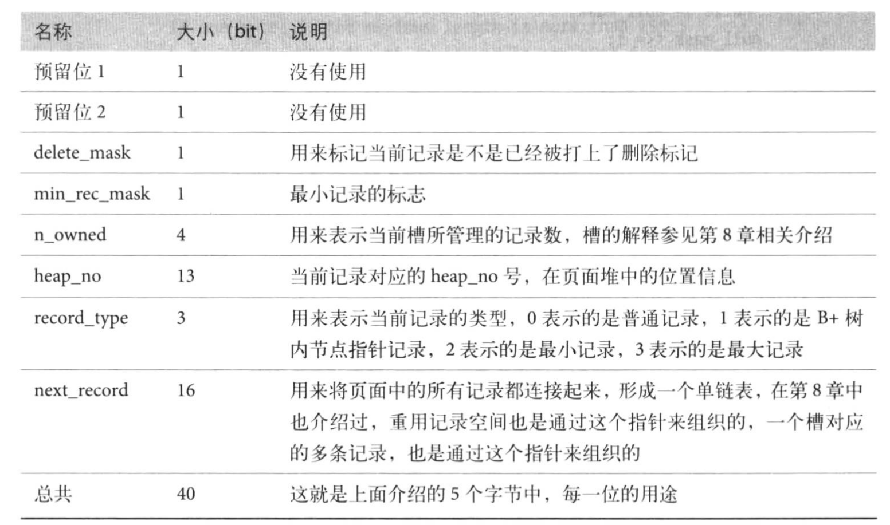

# 09_innodb_record_format

## InnoDB 行格式
* Server 层格式
    * 与存储引擎无关,适用任何引擎
    * Row 模式下 Binlog 使用的一种格式
* 索引元组格式
    * InnoDB 在存取格式时一种记录格式的中间状态
    * 从 Server 层转换而来 or 转换成 Server 层的格式
    * 同表内,不同索引对应的元组不同,元素格式与索引一一对应
* 物理存储格式
    * 在物理页面的存储格式, Compact 格式
    * 物理存储格式与索引元组格式一一对应,每次存取,都从 Server 格式 -> 索引元组格式 -> 物理存储格式
* 以 Innodb Insert 分析
    * @see [int handler::ha_write_row(uchar *buf)](../../../sql/handler.cc)
    * @see [int ha_innobase::write_row(uchar *record)](../../../storage/innobase/handler/ha_innodb.cc)
    * 从 Server 层的 ha_write_row 接口调用 InnoDB 层的 write_row 接口, InnoDB 会将收到的 Record 记录转换为 **元组 Tuple**(索引元组格式),这是与 Record 对应的 InnoDB 的表示方式,是内存的,逻辑的记录.在系统真正将其写入页面前,记录一直以 索引元组格式 存在.
* InnoDB 行数据 Extra Bytes 默认占用 5 bytes
    * 

2. row_id
    * InnoDB 在内存中维护一个全局变量,每当向某个包含 row_id 隐藏列的表中插入一条记录时,会把这个全局变量的值当作新纪录的 row_id 列的值,并把全局变量自增1.
    * 每当这个全局变量是256的倍数,会把该变量的值刷新到系统表空间号为7的页面中一个名为 Max Row ID 的熟悉中.
    * 当系统启动,会把 Max Row ID 属性加载到内存,并加上256之后赋值给全局变量.