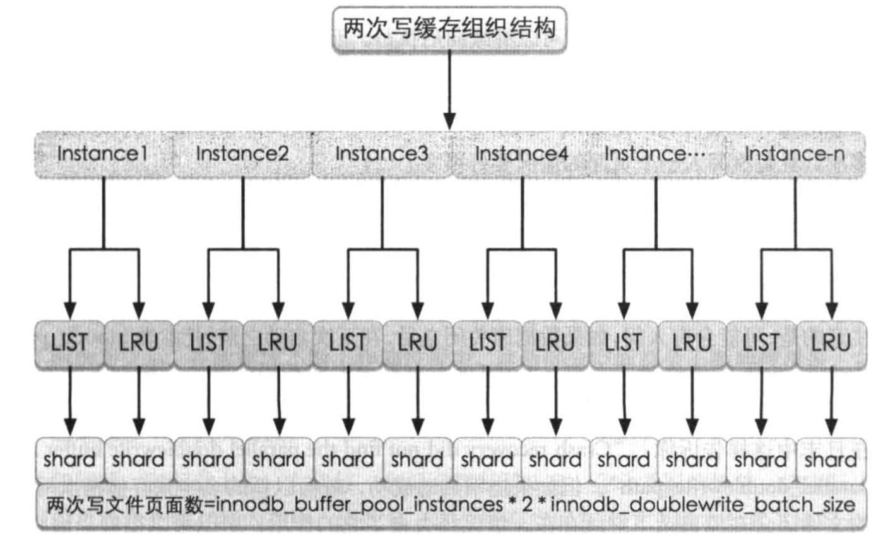

# 10_innodb_double_write

* double write
    * 单独对一个页面刷盘时的两次写
    * 批量刷盘时的两次写

## 单一页面刷盘

* @see [Doublewrite buffer in trx0sys.h](../../../storage/innobase/include/trx0sys.h)

* 在第一次建库的时候,会分配一个段的空间,段的地址会存储到 double write buffer 中 TRX_SYS_DOUBLEWRITE 偏移的位置.

* 偏移 `TRX_SYS_DOUBLEWRITE_BLOCK1` `TRX_SYS_DOUBLEWRITE_BLOCK2` 存储的是两次写空间的位置,在 ibdata1 中属于同一个段,属于两个不同的簇.每个簇占用1MB,一个簇包含64个页面,每个页面16KB.每次 double write 需要写入 64\*16KB\*2=2MB(默认值) 的数据.

* 偏移 `TRX_SYS_DOUBLEWRITE_REPEAT` 所指的位置将前面的 `TRX_SYS_DOUBLEWRITE_MAGIC`, `TRX_SYS_DOUBLEWRITE_BLOCK1`, `TRX_SYS_DOUBLEWRITE_BLOCK2` 重复存储一次.

* double write buffer
    * 页面刷盘的时候,如果开启了 double write ,InnoDB 不会直接将数据写入硬盘,而是先在 double write buffer 中,找到一个空闲位置,将这个位置标记位已使用,然后将整个页面的数据复制到空闲位置对应的缓存空间.复制完成后,系统会将这个页面的数据刷到两次写文件中,即 ibdata 文件.
    * buffer pool 中的页面刷到磁盘是异步IO,只有当自己表空间的数据刷盘操作完成后, double write buffer 的数据才可以被覆盖,否则可能这个位置的 double write buffer 数据被新的页面覆盖.如果上次真实表空间的刷盘没有完成,同时产生页面断裂的问题,此时页面数据无法恢复, double write 失去意义.

## 批量页面刷盘

* 批量刷盘包含两种方式, LRU 方式 与 LIST 方式.
    * LRU -> Buffer pool 空间不足时,将不使用的老页面淘汰,系统找到老的页面进行刷盘
    * List方式 -> 日志空间不足/后台 master thread 定时任务 刷盘时,去需要区分页面的新旧状态,只需选择 LSN 最小的页面,从前到后刷文件

## double write structure

* InnoDB 自身的整个 buffer pool 分为多个 instance ,每个 instance 管理自身的一套 double write 空间,针对每个 instance 的每个刷盘方法的批量缓存空间大小,通过参数 innodb_doublewrite_batch_size 控制,默认120.

* innodb_doublewrite_batch_path 所指的文件大小计算方法:
    * 两次写文件页面个数 = innodb_buffer_pool_instances * 2(LIST+LRU) * innodb_doublewrite_batch_size
    * 

## 批量刷盘两次写实现原理

* 基于 LRU ,系统需要将要淘汰的页面加入 double write buffer ,根据当前页面所在的 Instance 号及刷盘类型可找到对应的 shard 缓存,找到后,判断当前 shard 是否已满,是否已到达 innodb_doublewrite_batch_size 的大小.如果没有达到,则将当前页面内容追加到当前 shard 缓存中,当前页刷盘操作完成.
* 如果当前 shard 页面个数达到 innodb_doublewrite_batch_size ,说明当前缓存空间已满,必须将 当前 shard 缓存的页面写入 两次写文件,写完后再 flush 到磁盘.(此时可能随机写,写 double write buffer 是顺序写的,因为两次缓存写中的页面是连在一起的,但是真实页面可能不是连在一起.)
* 表空间页面的刷盘是异步的 IO 操作,此时需要等待 异步IO 完成,且整个 shard 中页面都刷盘后,才可以继续向后执行.当前 shard 也可重新使用,缓存中数据会清空.

## 单一页面刷盘 与 批量页面刷盘 区别
* 单一页面刷盘需要 写入 double write buffer ,并立刻写入磁盘
* 批量页面刷盘需要 写入 double write buffer 对应 instance 号 及 shard 缓存,并执行写入.(当前 shard 缓存页面个数小于 innodb_doublewrite_batch_size )

## 两次写作用
* 数据库启动(异常关闭的情况下),都会执行数据库恢复(redo).恢复过程中,数据库会检查页面是否合法,如果发现一个页面的数据校验结果不一致,通过 double write ,用两次写空间的数据来恢复异常页面的数据.
* 将 double write 的簇都读出来,再将 innodb_parallel_doublewrite_path 文件的内容读出来,将所有页面协会到对应的页面去,这样可保证这些页面是正确的.在写回到对应的页面去后,可在此基础上做数据库恢复.