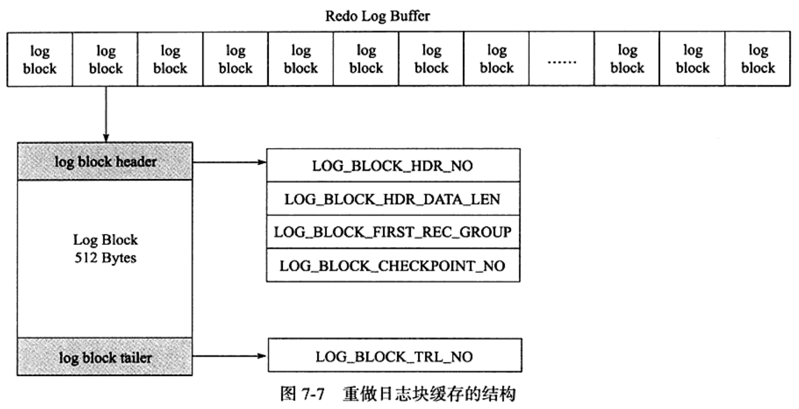
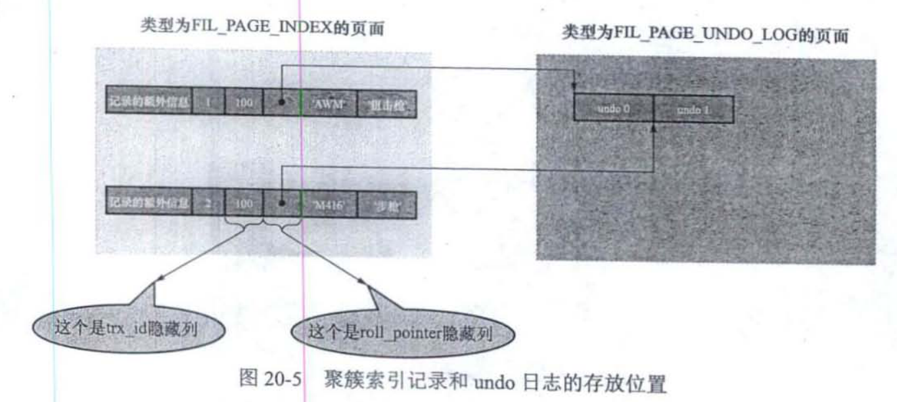

# 12_redo_undo_mvcc

1. redo
    1. redo 日志格式
        * 简单的类型
            * MLOG_1BYTE(type 0x01):页面某个偏移量处写入1byte的redo类型
            * MLOG_2BYTE(type 0x02):页面某个偏移量处写入2byte的redo类型
            * MLOG_4BYTE(type 0x04):页面某个偏移量处写入4byte的redo类型
            * MLOG_8BYTE(type 0x08):页面某个偏移量处写入8byte的redo类型
            * MLOG_WRITE_STRING(type 0x1E):页面某个偏移量处写入一个字节序列
            * MLOG_MULTI_REC_END(type 0x1F)
            * 
            * 
        * 复杂的类型
            * MLOG_REC_INSERT(type 0x09):插入一条使用非紧凑行格式(REDUNDANT)记录,redo日志类型
            * MLOG_COMP_REC_INSERT(type 0x26):插入一条使用紧凑行格式(COMPACT,DYNAMIC,COMPRESSED)记录,redo日志类型
            * MLOG_COMP_PAGE_CREATE(type 0x3A):创建一个存储紧凑行格式的页面,redo日志类型.
            * MLOG_COMP_REC_DELETE(type 0x2A):删除一条使用紧凑行格式记录,redo日志类型
            * MLOG_COMP_LIST_START_DELETE(type 0x22):从某条给定记录开始删除页面中一系列使用紧凑行格式的记录,redo日志类型
            * MLOG_COMP_LIST_END_DELETE(type 0x2B):与 MLOG_COMP_LIST_START_DELETE 对应,表示一系列删除,直到 MLOG_COMP_LIST_START_DELETE 类型的 redo 日志对应记录为止.
            * MLOG_ZIP_PAGE_COMPRESS(type 0x33):压缩一个数据页时,redo日志类型.
        * Redolog 的插入是不可分割的原子操作
        * 向 B+ Tree 插入记录前,需要定位记录在哪个叶子节点代表的数据页.定位到数据页后,有2类情况:
            * 该数据页空闲页面充足,足够容纳待插入记录,直接将记录插入到数据页中,记录一条 MLOG_COMP_REC_INSERT redo.**乐观插入**
            * 数据页剩余空间页面不足
                1. 页面分裂操作,新建叶子节点,原先数据页的一部分记录复制到新的数据页中,把记录插入进去.
                2. 把叶子节点插入到叶子节点链表中,在内节点添加一条目录项记录指向新创建的页面.
                3. 这个过程需要对多个页面修改,会产生多条 redolog ,称为悲观插入.
            * redolog 原子性 通过在该组 redolog 最后加上一条特殊类型的 redolog ,称为 MLOG_MULTI_REC_END .
                * 
                * 系统重启,只有解析到 MLOG_MULTI_REC_END 的 redo,才认为解析到一组完整的 redolog,才会进行恢复;否则直接放弃前面解析到的 redo 日志.
                * 部分需要保证原子性的操作只生成1条 redo 日志,例如更新 Max Trx ID 属性操作.
    2. Mini-Transaction
        * InnoDB 将对底层的一次原子访问封装为一个 Mini-Transaction
        * 
    3. redolog 写入流程
        1. redo log block  
        
            * @see [Redo log constants and functions](../../../storage/innobase/include/log0log.h)
            * @see [Redo log types](../../../storage/innobase/include/log0types.h)
        2. redo log buffer
            * Server 启动向 OS 申请内存作为 redo log buffer(redo日志缓冲区)的连续内存空间,简称 log buffer.
            * redo log buffer 被划分成若干连续的 redo log block.
            * redol log 从 buffer 中刷盘时,可能出现一个 block 内有多个 mtr 的 redolog.
            * 
            * 
        3. redo log 文件组
            * MySQL 数据目录下有名为 ib_logfile0 与 ib_logfile1 两个文件, log buffer 中的日志在默认情况下刷新到这两个文件中.可通过如下参数调节
                1. innodb_log_group_home_dir:指定 redo 日志文件所在目录,默认值时当前数据目录
                2. innodb_log_file_size:指定每个 redo 日志文件的大小,默认 48 MB
                3. innodb_log_files_in_group:指定 redo 日志文件的个数,默认值2,最大值100
                
                
                
        4. redo log 文件格式
            * block格式解析
                1. log file header:描述该 redolog 文件的一些整体属性
                    
                2. checkpoint1:记录关于 checkpoint 的一些属性
                    
                3. 第三个 block 未使用,忽略
                4. checkpoint2:结构与 checkpoint1 相同
        
        5. log sequence number
            1. InnoDB 设计 lsn 变量统计当前总共已经写入的 redolog 量. lsn 的初值是 8704.
            2. 在向 log buffer 写入 redolog 时不是一条一条写入,而是以 MTR 生成一组 redolog 日志为单位写入,实际上是把日志内容写在 log block body 处.
            3. 系统统计 lsn 的增长量时,按照实际写入的日志量加上占用的 log block header 和 log block trailer 来计算.
            4. 每一组由 MTR 生成的 redolog 都有唯一的 lsn 与其对应, lsn 值越小,说明 redolog 产生越早.
        
        6. flushed_to_disk_lsn
            * buf_next_to_write     ->  标记当前 log buffer 中已经有那些日志被刷新到磁盘中
            * flushed_to_disk_lsn   ->  刷新到磁盘中的 redolog 量的全局变量(系统刚启动时,固定值 8704 )
            * 
        
        7. checkpoint
            1. 全局变量 checkpoint_lsn ,表示当前系统中可被覆盖的 redolog 总量,初值 8704.
2. undo
    1. 事务ID(trxid)  
    分配的时机:  
        * 只读事务,第一次对用户的临时表执行增删改操作,才会分配事务ID,否则不分配事务ID.
        * 读写事务,第一次对某个表(包含用户的临时表)执行增删改操作,才会分配事务ID,否则不分配事务ID.
    2. 事务ID生成
        * 服务器在内存维护一个全局变量,需要为某个事务分配事务ID时,改变量的值作为事务ID分配给该事务,并且该变量自增1.
        * 每当这个变量是256的倍数,将这个变量的值刷新到系统表空间5号页面的 Max Trx ID 属性,这个属性占用8字节的存储空间.
        * 当系统下一次重新启动,会将 Max Trx ID 加载到内存,将该值加上256赋值到全局变量.
    3. trx_id 隐藏列
        * 聚簇索引会保存完整的用户数据,还会增加 trx_id, roll_pointer 隐藏列.如果用户在表中没有定义主键以及不允许存储 NULL 值的 UNIQUE 键,还会自动添加一个名为 row_id 的隐藏列.
    4. undo 日志格式
        * undo 日志被记录到 FIL_PAGE_UNDO_LOG(对应0x0002)页面,这些页面从系统表空间中分配,也可从专门存放 undo 日志的表空间(undo tablespace)中分配.
        * INSERT undo
            * 
            * 如果主键只包含一列,则 trx_undo_insert_rec 的 undo 日志,只需要把该列占用的存储空间大小和真实值记录下来.如果记录中的主键包含多个列,需要记录每个列的存储空间大小和对应的真实值.
            * 在 Seata FMT 中, Seata Client 会拦截客户端的SQL,并且记录 DML 执行的前像,记录到 seata_undo_log 表中.原理与 InnoDB 类似.
            * 当向表插入数据时,需要向聚簇索引和所有二级索引都插入一条记录.在记录 InnoDB undolog 时,只需要记录聚簇索引的数据,因为聚簇索引记录和二级索引记录是一一对应的.回滚 Insert 的时候,将 undolog 中的数据取出来,根据主键信息进行对应的删除操作.执行删除操作时,会把聚簇索引和所有二级索引的记录都删掉.
            * roll pointer
                * 
        * DELETE undo
            * delete 流程
                1. 将记录的 deleted_flag 标识设置为1,叫做 delete mark.
                2. 当删除语句的事务提交后,有专门的线程来真正把记录删除掉.通过将该记录从正常的记录链表中移除,并加入到垃圾链表中.并且调整 页面中的用户记录数量PAGE_N_RECS, 上次插入记录的位置PAGE_LAST_INSERT, 垃圾链表头节点的指针PAGE_FREE, 页面中的可重用字节数PAGE_GARBAGE,叫做 purge.